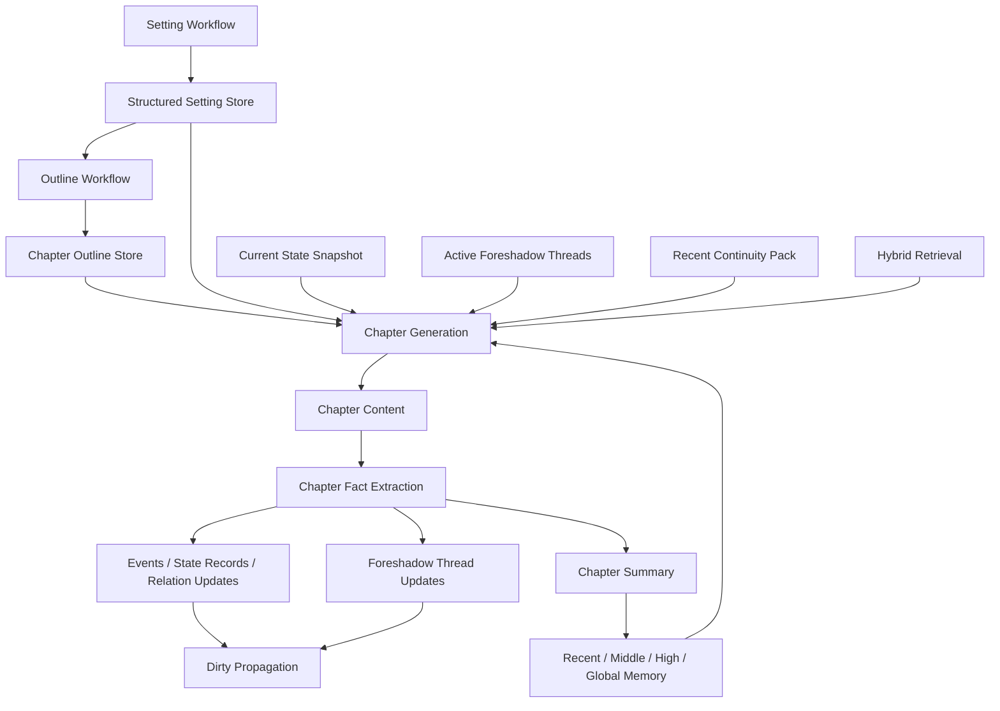

# 小说章节生成企业级改造路线图

## 1. 文档目标

本文件用于定义 `ai-novel-studio` 在章节生成链路上的企业级改造方案，覆盖：

- 当前静态代码现状审计
- 风险分级与未来必然返工点
- `V1 / V2` 目标架构
- 数据模型演进方案
- Prompt / Context 结构规范
- 章节后处理与状态更新机制
- 伏笔机制与后续 RAG / 向量库接入路径
- 详细任务拆解、依赖关系、静态验收点

本轮不要求把项目跑起来，不做运行时联调结论；所有判断基于静态代码和现有文档。

## 2. 约束与已确认决策

- 允许新增数据库表
- 允许调整接口结构
- 允许后续接入向量库
- 当前优先顺序为：`先补设计文档，再重构`
- 后续允许直接进入代码实现

## 3. 当前静态架构审计

### 3.1 现有主链路

当前项目已经形成以下基础流程：

1. 创意生成
2. 设定工作流
3. 结构化设定落库
4. 大纲工作流
5. 章节大纲生成
6. 章节正文生成 / 重写
7. 单章摘要生成
8. 分层记忆压缩

主要代码入口：

- 设定工作流：`SettingWorkflowServiceImpl`
- 大纲工作流：`OutlineWorkflowServiceImpl`
- 章节生成：`ChapterServiceImpl`
- 章节记忆：`ChapterMemoryServiceImpl`
- AI 编排：`AiOrchestratorService`
- Prompt 模板：`PromptTemplateService`
- 模型适配：`OpenAiCompatibleNovelAiClient`
- 前端工作台聚合：`frontend/src/composables/useNovelWorkspace.ts`

### 3.2 现有 AI 消息模型

当前模型调用仍是最基础的两段消息结构：

- `system`
- `user`

特点：

- 没有工具调用
- 没有结构化 response schema
- 没有独立的 context block
- 没有 retrieval block
- 没有 state delta block
- 没有 post-check block

这意味着当前编排能力偏弱，后续每加一种长期能力，都会继续把 `user prompt` 撑大。

### 3.3 现有章节上下文来源

当前 `buildChapterContext` 已经组装了以下信息：

- 作品基础信息
- 设定库 `summary`
- 设定库 `overview`
- 全局大纲
- 当前章节标题 / 大纲 / scenePlan
- 上一章摘要与结尾片段
- 全局摘要
- 高层摘要
- 中层摘要
- 近窗摘要

这是一个有效的第一代上下文模型，但本质仍然是“摘要拼盘”。

### 3.4 当前已经存在但未真正接入章节生成的资产

项目已经有结构化设定相关表和接口：

- `characters`
- `organizations`
- `locations`
- `items`
- `world_rules`
- `story_events`
- `entity_relations`
- `entity_state_records`

这些结构已经能承载“当前事实层”，但目前章节生成并没有把它们系统性接入 prompt。

### 3.5 当前章节后处理机制

当前章节生成或手工编辑后，会执行：

1. 生成单章摘要
2. 更新 recent window
3. 满窗时压缩为 middle memory
4. 满中层时压缩为 high memory
5. 更新 global memory

优点：

- 已经有多层记忆压缩框架
- 已经有版本记录与任务记录

缺点：

- 只更新“摘要型记忆”
- 不更新“事实型状态”
- 不追踪“伏笔线程”
- 不做“后续章节脏标记”

### 3.6 前端当前耦合方式

前端工作台已经把以下能力直接绑定到单一状态机：

- 设定工作流
- 大纲工作流
- 章节生成
- 项目记忆展示
- 手工实体维护

这说明后续接口变更不仅影响后端，也会影响：

- `novelApi.ts`
- `types.ts`
- `useNovelWorkspace.ts`
- 对应页面组件

因此设计阶段必须把接口演进路线提前写清，避免后面前后端一起大改。

## 4. 当前最高风险问题

### 4.1 当前最大结构性问题

**章节生成仍然不是“事实状态驱动”，而是“摘要驱动”。**

这会导致：

- 长程角色状态漂移
- 远距伏笔难以稳定召回
- 回溯重写后事实同步困难
- prompt 规模持续膨胀
- 向量库接入后依然会召回脏数据

### 4.2 短期可跑、长期必返工的问题

1. `context` 使用 `Map<String, Object>`，缺少稳定 DTO
2. context key 为自由文本，难以演进和复用
3. prompt 把整包 context 直接塞进 `user`
4. 没有“相关实体选择器”
5. 没有“当前事实快照”
6. 没有“状态变化 delta”
7. 没有“伏笔线程对象”
8. 没有“章节编辑后的脏传播”
9. 没有“回算 / 重建”能力
10. 没有“检索抽象层”

### 4.3 中期会炸的问题

1. 改写第 20 章后，后续 21+ 章的摘要、状态、伏笔可能全部脏掉
2. 只有摘要，没有事实抽取，后续质量检查无法做严谨比对
3. 只有分层摘要，没有明确“当前角色状态”
4. 伏笔若只写在摘要文本里，后期无法精准控制回收
5. 如果未来接向量库，缺少规范化切片和元数据体系

## 5. 改造目标

## 5.1 V1 目标

V1 的目标不是一步到位上 RAG，而是先把章节生成内核从“摘要拼装”升级到“状态驱动”：

- 引入稳定的 `ChapterContext` 结构
- 引入章节后“事实抽取”机制
- 引入最小可用的“伏笔线程模型”
- 引入基础脏标记与重算边界
- 重构 prompt 结构，但仍保持 `system + user`

## 5.2 V2 目标

在 V1 稳定后，再做：

- 混合检索 / 向量库
- 相关实体自动筛选
- 长程回收与重写影响传播
- 连续性检查与自动审计
- 大规模回算与回填工具

## 6. 目标企业级架构



### 6.1 核心组件

V1 / V2 最终需要形成以下核心服务：

1. `ChapterContextAssembler`
2. `StoryStateSnapshotService`
3. `ChapterFactExtractionService`
4. `ForeshadowThreadService`
5. `ChapterMemoryService`
6. `DirtyPropagationService`
7. `PromptContractService`
8. `GenerationSnapshotService`
9. `RetrievalService`（V2）
10. `ContinuityCheckService`（V2）

## 7. V1 设计

### 7.1 统一 ChapterContext

V1 必须引入稳定 DTO，替代当前临时 `Map<String, Object>`。

建议结构：

```text
ChapterContext
- projectProfile
- immutableSetting
- storyPlan
- currentChapter
- continuity
- currentState
- activeThreads
- memoryStack
- generationConstraints
```

建议字段拆分：

#### projectProfile

- projectId
- title
- genres
- platformTarget
- stylePreference
- targetWordCountMin
- targetWordCountMax
- targetChapterWordCount

#### immutableSetting

- settingSummary
- settingOverview
- worldRules
- narrativeRules
- forbiddenRules

#### storyPlan

- globalOutline
- currentVolume
- currentArc
- activeGoals
- activeConflicts
- requiredPayoffs

#### currentChapter

- chapterId
- chapterNo
- title
- outline
- scenePlan
- requestedRevisionAdvice

#### continuity

- previousChapterSummary
- previousChapterTail
- unresolvedThreads
- continuityConstraints

#### currentState

- relevantCharacters
- relevantOrganizations
- relevantLocations
- relevantItems
- relevantRelations
- relevantEvents
- relevantStateRecords

#### activeThreads

- foreshadowThreads
- promises
- mysteries
- hiddenRisks

#### memoryStack

- globalMemory
- highMemories
- middleMemories
- recentSummaries

#### generationConstraints

- pov
- tense
- narrationStyle
- pacing
- mustDo
- mustNotDo

### 7.2 事实状态快照

章节生成前，不应只拿摘要，应构建一份“当前事实快照”。

V1 先做“最小快照”：

- 与当前章大纲相关的人物
- 上一章出场人物
- 当前 arc / 当前 volume 高重要度实体
- 与未解事项相关的物品 / 地点 / 关系
- 最近一次被更新的状态记录

这份快照的来源优先级应为：

1. `entity_state_records`
2. `story_events`
3. `entity_relations`
4. 结构化设定主表
5. 多层摘要

### 7.3 章节后事实抽取

V1 在现有摘要链路前，新增一步：

`Chapter Content -> Fact Extraction -> Summary / Memory`

抽取结果至少包含：

- key events
- character state changes
- location changes
- item ownership changes
- relation changes
- newly introduced constraints
- unresolved threads
- foreshadow setup / advance / payoff candidates

抽取后写入：

- `story_events`
- `entity_state_records`
- `entity_relations`（必要时）
- `chapter_summaries`
- `foreshadow_threads`（新增）

### 7.4 最小伏笔线程模型

V1 必须新增伏笔线程对象，不能继续只依赖 `chapter_summary.foreshadowChanges`。

建议新增表：`foreshadow_threads`

建议字段：

- `id`
- `project_id`
- `thread_key`
- `title`
- `description`
- `thread_type`：`foreshadow / promise / mystery / secret / callback`
- `status`：`open / hinted / escalated / paid_off / abandoned`
- `importance`
- `setup_chapter_id`
- `setup_chapter_no`
- `setup_excerpt`
- `expected_payoff_scope`
- `last_touched_chapter_id`
- `payoff_chapter_id`
- `payoff_notes`
- `source_state_record_ids`
- `source_event_ids`
- `created_at`
- `updated_at`

可选新增关联表：`foreshadow_thread_links`

字段建议：

- `thread_id`
- `entity_type`
- `entity_id`
- `link_role`

如果 V1 想更轻，可以先不做 links 表，先把关联实体写成 JSON。

### 7.5 Prompt 结构重构

V1 不要求切换消息协议，但必须重构 prompt block。

`system` 只放稳定规则：

- 身份
- 输出约束
- 事实优先级
- 不可违反的写作约束

`user` 按固定 block 输出：

1. TASK
2. GOAL
3. CHAPTER_PLAN
4. CONTINUITY
5. CURRENT_STATE
6. ACTIVE_THREADS
7. MEMORY_STACK
8. CONSTRAINTS
9. ACCEPTANCE

### 7.6 脏标记和重算边界

V1 不需要完整自动回算系统，但必须先定义脏传播边界。

任何会导致后续事实变化的动作，都要标记下游脏数据：

- 手工编辑章节正文
- AI 重写章节正文
- 章节回滚版本
- 设定实体关键字段改动
- 状态记录手工改动
- 伏笔线程手工改动

V1 最小实现建议：

- `chapters.content_dirty_from_chapter_no`
- 或新增 `story_dirty_marks`

建议新增表：`story_dirty_marks`

字段：

- `id`
- `project_id`
- `source_type`
- `source_id`
- `start_chapter_no`
- `dirty_scope`
- `reason`
- `status`
- `created_at`

## 8. V2 设计

### 8.1 混合检索与向量库

V2 接入 Retrieval，而不是一上来把所有事实交给向量库。

检索原则：

- 当前事实以关系型状态表为准
- 向量库只负责召回相关历史材料
- 检索必须带 metadata 过滤

建议可被向量化的对象：

- 章节摘要
- 关键正文片段
- 伏笔 setup excerpt
- 设定总览分块
- 人物卡
- 地点卡
- 物品卡
- 规则卡
- 事件说明

建议 metadata：

- `projectId`
- `entityType`
- `entityId`
- `chapterNo`
- `chapterRangeStart`
- `chapterRangeEnd`
- `documentType`
- `confirmed`
- `current`
- `importance`
- `spoilerLevel`

### 8.2 相关实体自动选择

V2 需要引入 `RelevantEntityResolver`，按以下线索筛选 context：

- 当前 chapter outline 命中的实体
- 上一章尾声出场实体
- unresolved threads 关联实体
- active foreshadow 关联实体
- 当前 arc / 当前 volume 高优先级实体
- 最近 N 章状态有变化的实体

### 8.3 连续性检查

V2 增加章节生成后自动检查：

- OOC 检查
- 时间线冲突检查
- 状态回退检查
- 未授权设定新增检查
- 伏笔回收冲突检查
- 与当前 state snapshot 不一致检查

### 8.4 回算与回填

V2 增加以下能力：

- 指定章节后的摘要重建
- 指定章节后的状态重建
- 指定章节后的伏笔线程重建
- 指定章节后的 embedding 重建
- 指定章节后的全局记忆重建

## 9. 数据模型演进建议

### 9.1 V1 必做新增

1. `foreshadow_threads`
2. `story_dirty_marks`

### 9.2 V1 推荐新增

3. `chapter_fact_extraction_runs`

字段建议：

- `id`
- `project_id`
- `chapter_id`
- `source_content_version_id`
- `model_config_id`
- `status`
- `raw_output_json`
- `normalized_output_json`
- `issues_json`
- `created_at`

用途：

- 保存事实抽取原始结果
- 便于回放与审计
- 便于人工修正

### 9.3 V2 推荐新增

4. `retrieval_documents`
5. `retrieval_embeddings` 或外部向量库映射表

如果向量库存外部服务，建议至少保留本地映射：

- `document_id`
- `provider`
- `external_vector_id`
- `content_hash`
- `status`

## 10. 端到端流程定义

### 10.1 章节生成

1. 读取确认版设定与大纲
2. 解析当前 chapter plan
3. 构建 current state snapshot
4. 检索 active threads
5. 读取 recent continuity pack
6. 读取 memory stack
7. 组装 `ChapterContext`
8. 生成正文
9. 保存版本与任务记录
10. 触发事实抽取
11. 更新状态 / 伏笔 / 摘要 / memory
12. 记录脏传播结果

### 10.2 章节重写

1. 读取旧正文
2. 读取同样的 `ChapterContext`
3. 附加 rewrite instruction
4. 生成新正文
5. 标记当前章之后的数据为潜在脏
6. 重新执行事实抽取与摘要
7. 更新下游状态

### 10.3 手工编辑章节

1. 写入新正文
2. 写版本
3. 标记下游 dirty
4. 重跑事实抽取
5. 重跑摘要 / memory
6. 视需要进入后续回算队列

## 11. 详细任务树

下面的任务树按“先设计、再重构、后增强”拆分。

### Epic A：上下文内核重构

#### A1. 定义 `ChapterContext` DTO 与子结构

- 目标：替代 `Map<String, Object>`
- 依赖：无
- 触点：
  - `ChapterMemoryService`
  - `ChapterMemoryServiceImpl`
  - `AiOrchestratorService`
  - `PromptTemplateService`
- 静态验收：
  - 新增 `ChapterContext` 及子 DTO
  - `buildChapterContext` 返回 DTO 而不是裸 `Map`
  - `rg "Map<String, Object> context = chapterMemoryService.buildChapterContext"` 不再存在

#### A2. 引入 `ChapterContextAssembler`

- 目标：把上下文组装逻辑从记忆服务中拆出
- 依赖：A1
- 触点：
  - 新服务类
  - `ChapterServiceImpl`
  - `ChapterMemoryServiceImpl`
- 静态验收：
  - `ChapterServiceImpl` 不再直接依赖 `ChapterMemoryService` 构建 context
  - 组装逻辑集中到新服务

#### A3. 固定 context block 序列化规范

- 目标：统一 prompt 输入结构
- 依赖：A1
- 触点：
  - `PromptTemplateService`
  - JSON 序列化辅助工具
- 静态验收：
  - prompt 中不再直接把自由结构 context 整包输出
  - 存在明确 block render 方法

### Epic B：事实抽取链路

#### B1. 定义 `ChapterFactExtraction` 输出结构

- 目标：规范摘要之外的事实抽取
- 依赖：A1
- 静态验收：
  - 存在 DTO / schema 定义
  - 字段至少包含 events / stateChanges / relationChanges / foreshadowChanges / unresolvedThreads

#### B2. 新增 `ChapterFactExtractionService`

- 目标：生成正文后先抽取事实，再更新摘要
- 依赖：B1
- 触点：
  - `AiOrchestratorService`
  - `PromptTemplateService`
  - `ChapterServiceImpl`
- 静态验收：
  - `refreshAfterChapterContent` 前或内部先执行事实抽取
  - 单章摘要不再是唯一后处理入口

#### B3. 引入抽取结果落盘

- 目标：保留可审计的抽取结果
- 依赖：B1
- 触点：
  - 新 migration
  - mapper / entity
  - service
- 静态验收：
  - migration 存在
  - entity / mapper 存在
  - 调用链可查到插入逻辑

### Epic C：伏笔线程

#### C1. 新增 `foreshadow_threads` 表

- 目标：用对象追踪伏笔生命周期
- 依赖：无
- 静态验收：
  - migration 存在
  - entity / mapper 存在

#### C2. 新增 `ForeshadowThreadService`

- 目标：根据事实抽取结果创建 / 推进 / 回收伏笔线程
- 依赖：B1, C1
- 静态验收：
  - service 存在
  - 章节后处理可调用

#### C3. 在 context 中注入 active threads

- 目标：让模型显式看到相关伏笔
- 依赖：C2, A2
- 静态验收：
  - `ChapterContext.activeThreads` 存在
  - prompt block 中有 `ACTIVE_THREADS`

### Epic D：状态快照

#### D1. 新增 `StoryStateSnapshotService`

- 目标：从结构化设定表 + 状态记录构建当前事实快照
- 依赖：A1
- 静态验收：
  - service 存在
  - `currentState` 有独立构建逻辑

#### D2. 加入 relevant entity resolver

- 目标：只向章节生成注入相关实体，避免 prompt 爆炸
- 依赖：D1
- 静态验收：
  - 存在相关性选择逻辑
  - 不再默认全量注入所有实体

### Epic E：Prompt 改造

#### E1. 重写 chapter generation prompt block

- 目标：从“整包 JSON”升级为“固定 block”
- 依赖：A3, C3, D1
- 静态验收：
  - `PromptTemplateService` 存在 block 渲染方法
  - prompt 文本中包含 TASK / CONTINUITY / CURRENT_STATE / ACTIVE_THREADS 等固定段

#### E2. 重写 chapter rewrite prompt block

- 目标：重写链路与生成链路共用 context contract
- 依赖：E1
- 静态验收：
  - rewrite prompt 使用相同 block 体系

#### E3. 为事实抽取新增 prompt

- 目标：把 post-processing 从摘要 prompt 拆成“事实抽取 prompt + 摘要 prompt”
- 依赖：B1
- 静态验收：
  - `PromptTemplateService` 新增事实抽取模板

### Epic F：脏传播与回算

#### F1. 新增 `story_dirty_marks`

- 目标：显式记录下游脏区间
- 依赖：无
- 静态验收：
  - migration / entity / mapper 存在

#### F2. 在重写和手工编辑后写入 dirty marks

- 目标：建立最小脏传播链路
- 依赖：F1
- 触点：
  - `ChapterServiceImpl`
- 静态验收：
  - `updateChapterContent`
  - `rewriteChapter`
  - 至少一个路径会写 dirty mark

#### F3. 定义回算任务接口

- 目标：为后续重建摘要、状态、伏笔、embedding 留接口
- 依赖：F1
- 静态验收：
  - service interface 存在
  - 当前可先空实现或 TODO 占位，但必须定接口

### Epic G：前后端接口演进

#### G1. 规范章节生成请求 DTO

- 目标：补齐生成约束字段
- 依赖：A1
- 建议字段：
  - `revisionAdvice`
  - `mustInclude`
  - `mustAvoid`
  - `targetWordCountOverride`
  - `povOverride`
  - `styleOverride`
- 静态验收：
  - DTO 更新
  - controller / service 使用到新字段

#### G2. 规范章节重写请求 DTO

- 目标：和生成接口保持对齐
- 依赖：G1
- 静态验收：
  - `ChapterRewriteRequest` 支持更多约束
  - 前端 API 同步更新

#### G3. 暴露伏笔线程查询接口

- 目标：让工作台后续可视化查看与手工修正伏笔
- 依赖：C1
- 静态验收：
  - controller / service / api types 存在

### Epic H：V2 检索层

#### H1. 定义 retrieval document 模型

- 目标：为向量化存储做切片规范
- 依赖：A1, C1

#### H2. 新增 `RetrievalService`

- 目标：提供混合检索统一接口
- 依赖：H1

#### H3. 章节生成接入 retrieval pack

- 目标：对远距伏笔、关键历史片段做补充召回
- 依赖：H2

## 12. 任务优先级排序

### P0

- A1
- A2
- B1
- B2
- C1
- C2
- D1
- E1
- F1
- F2

### P1

- A3
- B3
- C3
- D2
- E2
- E3
- G1
- G2
- G3

### P2

- F3
- H1
- H2
- H3

## 13. 推荐实施顺序

### V1-A：先把内核定型

1. A1
2. A2
3. D1
4. E1

### V1-B：再把“事实层”补上

5. B1
6. B2
7. B3

### V1-C：把长程剧情对象化

8. C1
9. C2
10. C3

### V1-D：处理后续一致性

11. F1
12. F2
13. G1
14. G2

### V2：增强检索与审计

15. D2
16. E2
17. E3
18. F3
19. H1
20. H2
21. H3

## 14. 每阶段静态验收标准

### V1 验收

- 存在 `ChapterContext` DTO 体系
- 章节生成与重写使用统一 context contract
- 存在事实抽取服务与 prompt
- 存在伏笔线程表与服务
- 章节后处理不再只有摘要更新
- 手工编辑和重写可标记 dirty
- 前后端 DTO 已同步到位

### V2 验收

- 存在 retrieval document 规范
- 存在 hybrid retrieval service
- 远距历史内容通过 retrieval 注入
- 存在回算接口
- 存在连续性检查扩展点

## 15. 预计工期

### 设计与静态审计阶段

- 当前文档补齐与任务树收口：`2.5 - 4.5 天`

### V1 实现阶段

- 预计：`1.5 - 3 周`

### V2 实现阶段

- 预计：`2 - 4 周`

## 16. 当前结论

当前项目最紧急的事情不是先接向量库，也不是继续堆 prompt，而是：

**先把章节生成从“摘要驱动”重构成“状态驱动”，并提前把伏笔线程纳入正式数据模型。**

理由：

- 这是未来返工成本最高的点
- 这是长篇连载稳定性的真正底盘
- 这是后续 RAG、审计、重写回算能否成立的前提

本文件作为后续 `V1 / V2` 实施的总蓝图。后续重构、接口调整、表结构新增，都应优先对齐本文件的边界与顺序。
